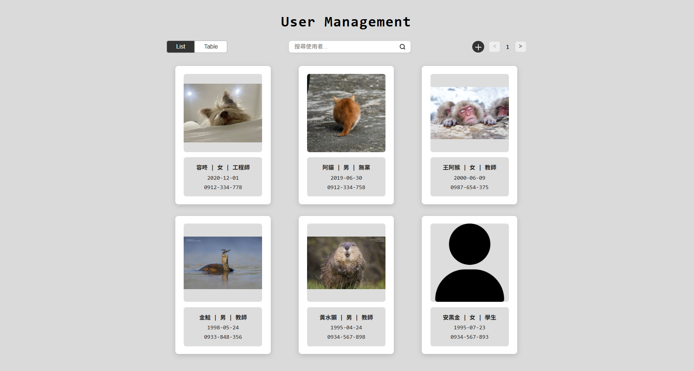
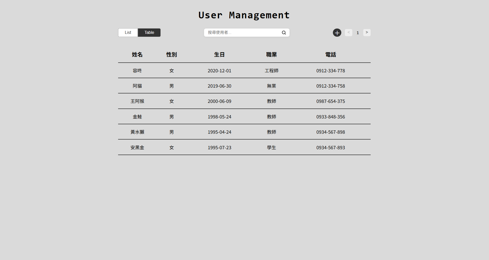
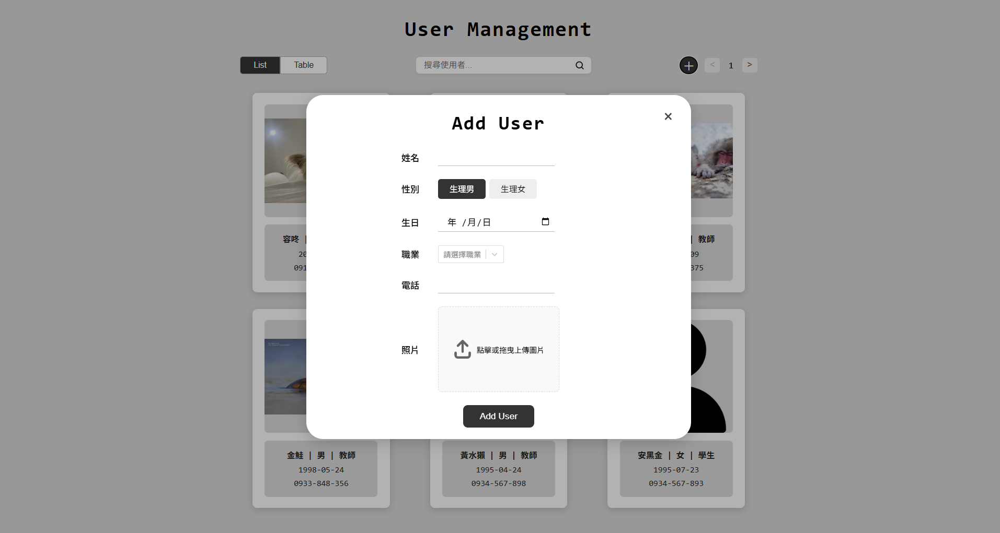
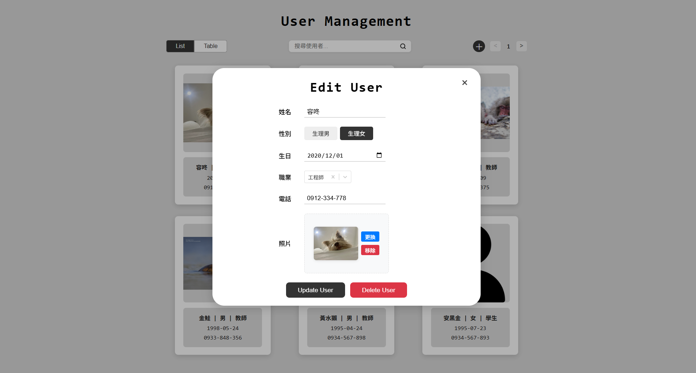

# User Management Frontend

## Introduction
React 製作的使用者管理介面

## Getting Start
### 1. Go to the frontend folder and install dependencies
   ```bash
   cd user_management_frontend
   npm install
   ```
### 2. Add ```.env``` file

### 3. Start Frontend Service
   ```bash
   npm start
   ```

| default port: 3000

### Page




